<!-- Animated terminal hero: pure SVG, plays right here in the README -->

  

## About

hello, I'm **bunnysayzz** — into devs, always building and learning.
Introvert, focused on code, not feeds.

Reach me: [stfuazzo@gmail.com](mailto:stfuazzo@gmail.com) · [macbunny.co](https://macbunny.co)

## Now building

**[SideTerminal](https://github.com/bunnysayzz/sideterminal)** — a native macOS terminal
that slides in from your screen edge and keeps every session alive while hidden.

  
  

## Stack

  
  
  
  
  

## Stats

  
  

